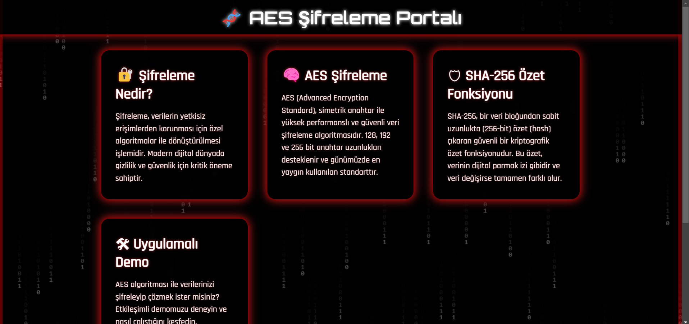
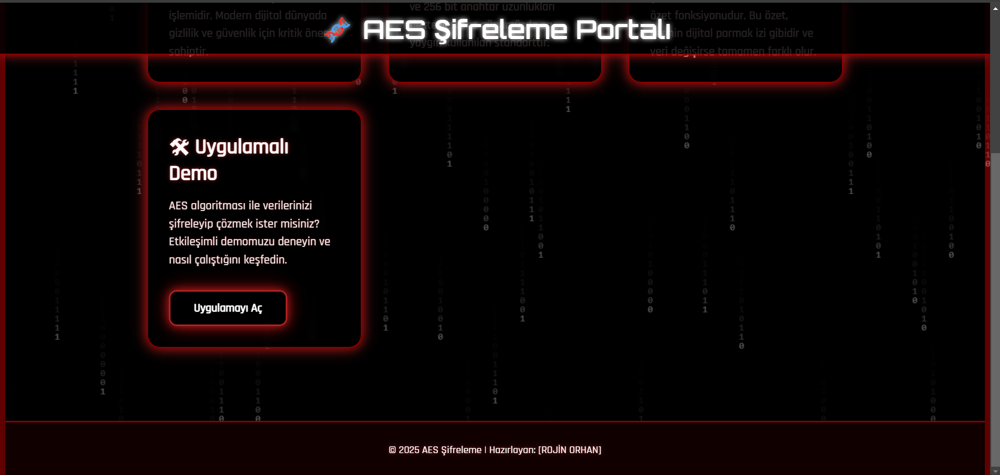
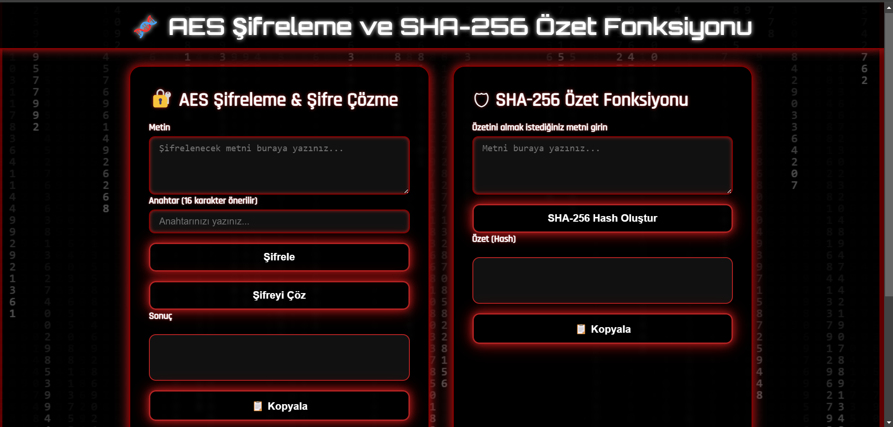
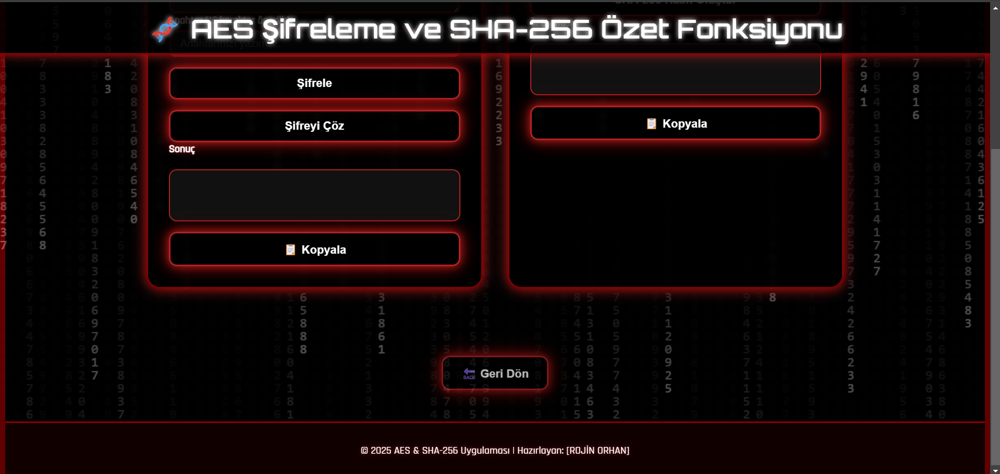

# 🎉 AES ve SHA-256 Şifreleme / Özetleme Uygulaması 🔐

---

## 🚀 Proje Hakkında

Modern web tarayıcılarında **AES-128** şifreleme ve şifre çözme ile **SHA-256** özetleme işlemlerini yapabileceğiniz bir araç!  

---

## ✨ Özellikler

- 🔑 **AES-128 Şifreleme / Şifre Çözme**  
  16 karakterlik anahtar ile hızlı ve güvenli veri şifreleme.
  
- 🛡️ **SHA-256 Özetleme**  
  Metinlerinizi güçlü ve tek yönlü hash algoritmasıyla özetleyin.

---

## 📋 Kullanım Kılavuzu

### AES Şifreleme / Şifre Çözme

1. **Metni Girin:** Şifrelemek veya şifre çözmek istediğiniz metni yazın.  
2. **Anahtarı Girin:** 16 karakterden oluşan bir şifreleme anahtarı girin (örneğin: `1234567890abcdef`).  
3. **Şifrele:** "Şifrele (AES)" butonuna basarak verinizi şifreleyin.  
4. **Şifre Çöz:** Şifrelenmiş metni aynı alana yapıştırın ve "Şifre Çöz (AES)" butonuna basın.

### SHA-256 Özetleme

1. **Metni Girin:** Özetini almak istediğiniz metni yazın.  
2. **SHA-256 Özetle:** Butona tıklayın, sonuç anında görüntülenecektir.

---

## 🛠️ Teknolojiler

- **HTML5, CSS3, JavaScript (ES6+)**  
- **Web Crypto API** (AES & SHA-256)  
- Modern ve duyarlı tasarım teknikleri

---

## 📂 Dosyalar

- `index.html` — Uygulamanın tamamını içeren ana dosya  
- `README.md` — Proje bilgileri ve kullanım kılavuzu

---

## 📸 Ekran Görüntüsü

---

